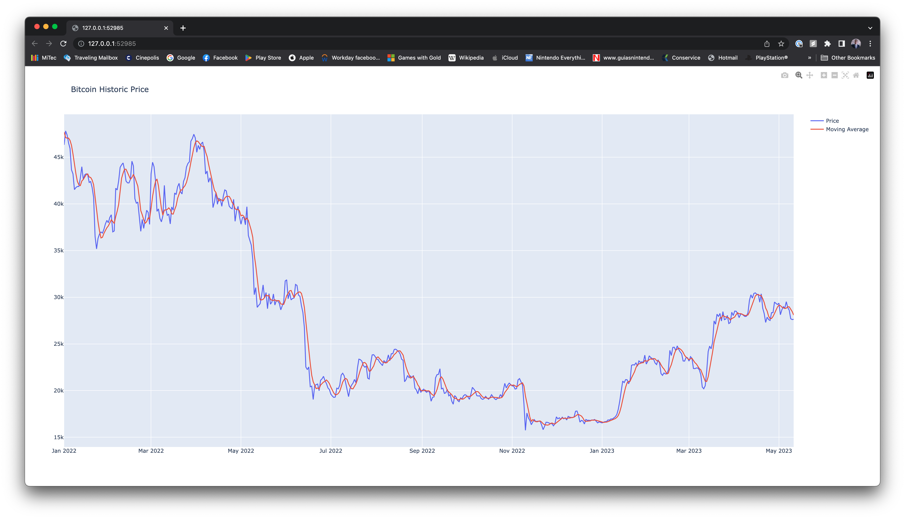

# 🪙 Bitcoin prices analytics project

👨‍💻 Alejandro Hahn
alex@hahn.mx

---

## 🚀 How to run the project?

To run the project, you should have installed Python 3 and run the following commands to create a virtual environment and install the dependencies denoted in the ```requirements.txt``` file  (Tested on MacOS, it might require to install Rust):


```
python -m venv venv
source ./venv/bin/activate
pip install -r requirements.txt
```

The project has 4 executable files:

1. Obtain bitcoin ID

```
python ./bitcoin_id.py
```

Should output ```bitcoin```

2. Pipeline:

```
python ./pipeline.py
```

This script starts a Prefect environment that updates the prices once a day until the process is stopped.

3. Backfill:

```
python ./backfill.py start_date end_date
```

This script executes a backfill that covers all the dates in the range we indicate as arguments.
The dates should be passed in the format ```dd-mm-yyyy```.
For example for the first quarter of 2022, the command should be:

```
python ./backfill.py 27-12-2021 31-03-2022
```

Please note that because of moving average requires the last 5 records we should also include the last dates of 2021.

4. Plot

```
python ./plot.py
```

This script display a plot of the bitcoin prices and moving average like the one shown below:



---

## 🤔 Assumptions and design decisions

For this project I tried to keep it as simple as possible, but with the assumption that it was required to have an automated task to get the data as the problem statement mentioned. 
I used tools that require minimal installation, so the project can be easily executed in other computers without replicating any environment.

I opted to use SQLite and Pandas, as both of them have minimal installation requirements in comparison to using other platforms. My first choice on DB was Mongo because clusters can be created online using the MongoDB Atlas service, but opted for SQLite as an in-memory database for simplicity.

In terms of orchestration, I added a script (```pipeline.py```) that runs a task to download the newest data daily. I decided to use Prefect 1.0 as it requires minimal installation in comparison to other engines.

Also decided towards a simple schema containing the date, price and 5d average, instead of multiple staging tables as other use cases usually require. This was to keep the project simple.

The code is divided generally in two, Getting and saving data -> Calculating averages.